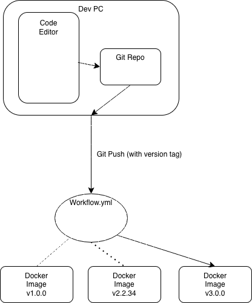

# Introduction to CI Project

The goal of this project is to be able to continuously edit your site (or whatever you are hosting) and have it generate a new image with these new changes correlated with a version tag. The tools used in this project are: 

- Docker file
  - This holds the configurations within docker
- Github Workflow
  - This detects a push within the Github repo and it executes commands based on a push. 

Diagram:

# Part 1

**Website and Dockerfile**

The web content is a folder with an index, css, and javascript hosting more than 1 html page on one of the 3 backend through the instance with Haproxy holding the elastic IP. 

- The link to the web content when reaching it as a user is:
  - http://98.90.170.238

- The link to the web content within the github repo is:
  - https://github.com/WSU-kduncan/ceg3120f25-CalebMcCool/tree/main/Project3/web-content

The Dockerfile is explaning the configurations within docker and the machine where the web content is stored. It is copying the current directory to the haproxy directory within the instance. 

- The link to the docker file within the github repo is:
  - https://github.com/WSU-kduncan/ceg3120f25-CalebMcCool/blob/main/Project3/web-content/Dockerfile

**Building and Pushing a container image to Dockerhub**

To build and push a container image to your dockerhub repo, you would type:

- Docker build -t project3site:latest
  - The -t flag is tagging and naming the image."calebmccool/project3site" is the name and ":latest" is the tag. 
- Docker push calebmccool/project3site:latest
  - This pushes the docker container to dockerhub under your specific login. 

**Running a Container Serving a Web Application**

To run a container serving a web application specifically on port 8080. You can use:

- docker run -d -p 8080:80 project3site

# Part 2

To create a PAT on Dockerhub, go to their website and login. Then you can go to settings and find the PAT section and create one. Then go to you Github repo and go to settings then secrets and variables. Then you can create a secret and name it. The secrets for this specific project is your github username and the personal access token to sign in.

The workflow is located within the .github/workflows folder and is titled project-workflow.yml. This workflow pushes your current repository onto docker when something is commited to the main branch or it is manually triggered. If you use this workflow in a different repository, you would need to change the branch name you are specifying.

Link to workflow file:

- https://github.com/WSU-kduncan/cicdf25-CalebMcCool/blob/main/.github/workflows/project-workflow.yml

# Part 3

To access your Github tags, you go to your Github repo, go into settings, and go under the tags section of the code and automation submenu. To push this tag, you just git push like you would with a commit.  To generate a tag in a git repo, you would use the command:

- git tag -a v1.0.0

The workflow triggers when there is any specified tag included. This needs to include major, minor, and patch sections. The workflow gets the version from your git push, and builds a docker image with the same version tag . 

If this was done in a different repo, you could just copy and paste the .yml file and put it within a new repo. You would not need to change anything, because this file is not dependent on the repo. 

Link to workflow file: 

- https://github.com/WSU-kduncan/cicdf25-CalebMcCool/blob/main/.github/workflows/project-workflow.yml

# Sources

**Part 2:**

- Assistance with creating the .yml file: Chatgpt 
  - prompt: "Give me an example .yml github workflow which logs in and builds a docker image"

**Part 3:**

- Assistance with editing the tag and metadata: Chatgpt
  - prompt: "What is the most efficient way of updating a workflow yml file which only deals with the 'latest' tag to incorporate version and docker metadata retrieval".
